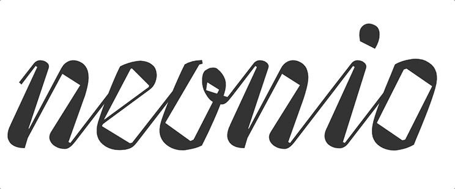

# Workshop Kerning Conference · 2019
This early draft of a Font was developed during [a Workshop](https://web.archive.org/web/20190606165217/https://2019.kerning.it/workshops.html) at the Kerning Conference in Faenza (Italy). Thanks to the mentors [Lila Symons](https://twitter.com/daycalligraphy/) and [Rainer Erich Scheichelbauer](https://twitter.com/mekkablue/).

